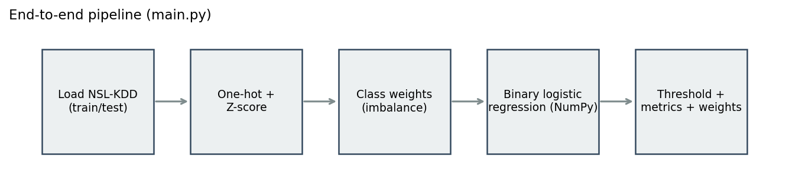
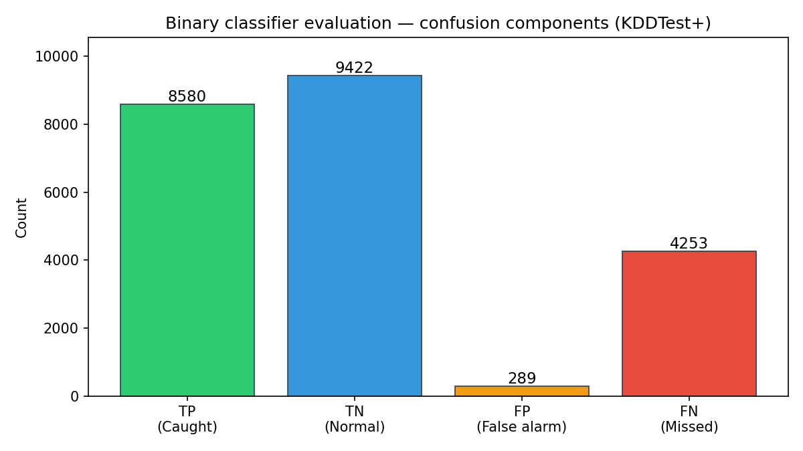

<a name="readme-top"></a>

<!-- PROJECT SHIELDS -->
<div align="center">
  <a href="https://github.com/01aptx01/Network-Intrusion-Detection-System/stargazers"></a>
  <a href="https://github.com/01aptx01/Network-Intrusion-Detection-System/issues"></a>
  <a href="https://github.com/01aptx01/Network-Intrusion-Detection-System/blob/main/LICENSE"></a>
  
</div>

<br />

<!-- PROJECT LOGO -->
<div align="center">
  <h3 align="center">Network Intrusion Detection System (NIDS)</h3>

  <p align="center">
    A robust, binary network traffic classification system designed to distinguish between normal behaviors and cyber-attacks using state-of-the-art machine learning techniques.
    <br />
    <a href="https://github.com/01aptx01/Network-Intrusion-Detection-System/tree/main/docs"><strong>Explore the docs »</strong></a>
    <br />
    <br />
    <a href="https://github.com/01aptx01/Network-Intrusion-Detection-System/issues">Report Bug</a>
    ·
    <a href="https://github.com/01aptx01/Network-Intrusion-Detection-System/issues">Request Feature</a>
  </p>
</div>

<!-- TABLE OF CONTENTS -->
<details>
  <summary>Table of Contents</summary>
  <ol>
    <li>
      <a href="#about-the-project">About The Project</a>
      <ul>
        <li><a href="#built-with">Built With</a></li>
      </ul>
    </li>
    <li><a href="#project-architecture">Project Architecture</a></li>
    <li>
      <a href="#getting-started">Getting Started</a>
      <ul>
        <li><a href="#prerequisites">Prerequisites</a></li>
        <li><a href="#installation">Installation</a></li>
      </ul>
    </li>
    <li><a href="#usage">Usage</a></li>
    <li><a href="#model-evaluation">Model Evaluation</a></li>
    <li><a href="#roadmap">Roadmap</a></li>
    <li><a href="#contributing">Contributing</a></li>
    <li><a href="#license">License</a></li>
    <li><a href="#contact">Contact</a></li>
  </ol>
</details>

## About The Project

This project implements a Network Intrusion Detection System (NIDS) as a binary classifier (normal vs. attack) leveraging the **NSL-KDD** dataset. Built with production readiness in mind, it utilizes tree-based models and standard machine learning frameworks to ensure high performance and maintainability.

The project strictly follows the industry-standard **Cookiecutter Data Science** methodology to ensure reproducibility, scalability, and ease of collaboration for data science teams.

**Key Features:**
*   **Advanced Model Implementations:** Supports models like XGBoost, LightGBM, CatBoost, Random Forests, and Logistic Regression.
*   **Robust Data Pipelines:** Automates categorical encoding, missing value imputation, and Z-score normalization.
*   **Imbalance Handling:** Automatically calculates and applies class weights for unbiased training.
*   **Comprehensive Evaluation:** Generates precision, recall, F1-score, confusion matrices, and feature importance reports.

<p align="right">(<a href="#readme-top">back to top</a>)</p>

### Built With

*   [](https://www.python.org/)
*   [](https://scikit-learn.org/)
*   [](https://pandas.pydata.org/)
*   [](https://numpy.org/)
*   [](#)
*   [](#)

<p align="right">(<a href="#readme-top">back to top</a>)</p>

## Project Architecture

The directory structure is organized as follows:

```text
├── Makefile           <- Commands for execution (e.g., `make data`, `make train`)
├── README.md          <- The top-level README for developers
├── data               
│   ├── external       <- Data from third-party sources
│   ├── interim        <- Intermediate data that has been transformed
│   ├── processed      <- Final canonical datasets for modeling
│   └── raw            <- Original immutable data dump (e.g., KDDTrain+.txt)
├── docs               <- Sphinx project and visual assets (images, models)
├── logs               <- System execution and training logs
├── models             <- Trained, serialized models (.pkl, .joblib, .npz)
├── notebooks          <- Jupyter notebooks (e.g., `1.0-jqp-data-exploration`)
├── pyproject.toml     <- Project configuration file
├── references         <- Data dictionaries and manuals
├── reports            <- Generated analysis (HTML, PDF, LaTeX)
│   └── figures        <- Graphics/figures used in reporting
├── requirements.txt   <- Environment dependencies
├── scripts            <- Standalone auxiliary scripts
├── src                <- Main source code
│   ├── config.py      <- Configuration variables and hyperparameter tuning
│   ├── data           <- Data preprocessing and downloading scripts
│   ├── features       <- Feature engineering scripts
│   ├── models         <- Model training, evaluation, and prediction scripts
│   └── visualization  <- Visualization generation scripts
└── tests              <- Unit and integration tests
```

<p align="right">(<a href="#readme-top">back to top</a>)</p>

## Getting Started

To get a local copy up and running, follow these simple steps.

### Prerequisites

Ensure you have Python 3.8 or higher installed.
* pip
  ```sh
  pip install --upgrade pip
  ```

### Installation

1. Clone the repository
   ```sh
   git clone https://github.com/01aptx01/Network-Intrusion-Detection-System.git
   ```
2. Navigate to the project directory
   ```sh
   cd Network-Intrusion-Detection-System
   ```
3. Install dependencies
   ```sh
   pip install -r requirements.txt
   ```
4. Prepare your dataset
   * Place the NSL-KDD raw data files (`KDDTrain+.txt` and `KDDTest+.txt`) into the `data/raw/` directory.

<p align="right">(<a href="#readme-top">back to top</a>)</p>

## Usage

To run the complete data pipeline (data loading, preprocessing, model training, evaluation, and artifact saving), execute the main script:

```sh
python main.py
```

**What happens during execution?**
1. **Preprocessing:** Raw data is cleaned, missing values handled, and features scaled/encoded.
2. **Training:** Models defined in the configuration are trained, utilizing class weights if specified.
3. **Evaluation:** The script evaluates the model against the test set, outputting key metrics.
4. **Serialization:** Trained models and scalers are saved into the `models/` directory for future inference.

_Detailed execution traces can be found in the `logs/` directory._

<p align="right">(<a href="#readme-top">back to top</a>)</p>

## Model Evaluation

Reference results from running the standard pipeline on the **NSL-KDD** dataset.

### Visualizations

| Pipeline Overview | Evaluation Summary |
| :---: | :---: |
|  |  |

> **Note**: Evaluation metrics vary based on hyperparameter tuning and model choice. Advanced tree models typically show significantly fewer False Negatives compared to linear baselines.

### Baseline Metrics (Example)

| Metric | Value |
|--------|------:|
| **True Positives (Caught Attacks)** | 8,088 |
| **True Negatives (Normal Traffic)** | 8,943 |
| **False Positives (False Alarms)** | 768 |
| **False Negatives (Missed Attacks)** | 4,745 |
| **Precision** | 0.9133 |
| **Recall** | 0.6303 |
| **F1-score** | 0.7458 |

<p align="right">(<a href="#readme-top">back to top</a>)</p>

## Roadmap

- [x] Adopt Cookiecutter Data Science structure
- [x] Integrate tree-based models (XGBoost, LightGBM, CatBoost)
- [ ] Implement k-Fold Cross Validation
- [ ] Add hyperparameter optimization using Optuna
- [ ] Deploy model via FastAPI for real-time inference

See the [open issues](https://github.com/01aptx01/Network-Intrusion-Detection-System/issues) for a full list of proposed features (and known issues).

<p align="right">(<a href="#readme-top">back to top</a>)</p>

## Contributing

Contributions are what make the open source community such an amazing place to learn, inspire, and create. Any contributions you make are **greatly appreciated**.

This project follows the [Conventional Commits](https://www.conventionalcommits.org/en/v1.0.0/) specification.

1. Fork the Project
2. Create your Feature Branch (`git checkout -b feature/AmazingFeature`)
3. Commit your Changes (`git commit -m 'feat(core): Add some AmazingFeature'`)
4. Push to the Branch (`git push origin feature/AmazingFeature`)
5. Open a Pull Request

<p align="right">(<a href="#readme-top">back to top</a>)</p>

## License

Distributed under the MIT License. See `LICENSE` for more information.

<p align="right">(<a href="#readme-top">back to top</a>)</p>

## Contact

01aptx01 - [GitHub Profile](https://github.com/01aptx01)

Project Link: [https://github.com/01aptx01/Network-Intrusion-Detection-System](https://github.com/01aptx01/Network-Intrusion-Detection-System)

<p align="right">(<a href="#readme-top">back to top</a>)</p>
